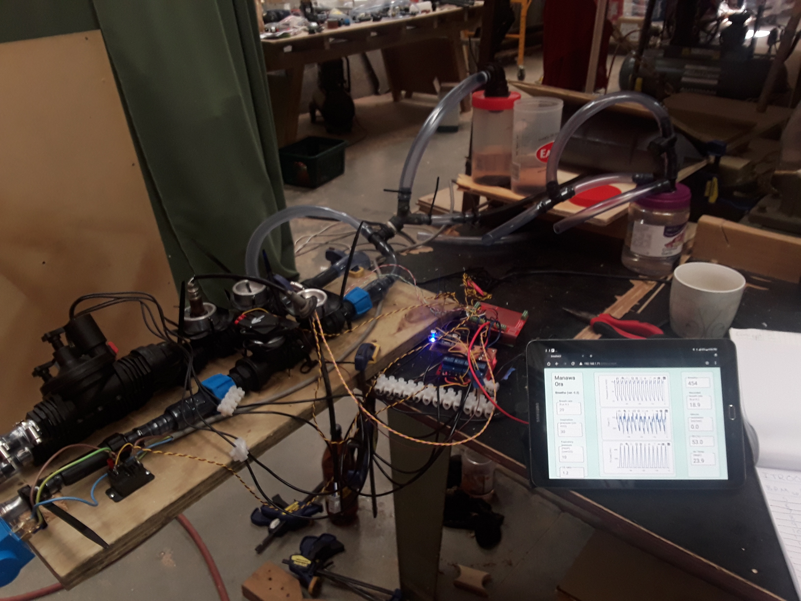

---
title: "Manawa Ora"
subtitle: "Technical Note after Agorize submission"
author: [Manawa Ora team]
date: 2020-04-03
titlepage: true
toc: true
toc-own-page: true
tags: [ventilator, agorize]
...

# Summary

This note is a collection of documents that were part of the submission in the
Agorize Competition: "Code Life Ventilator Challenge". The team name for that
competition was *Manawa Ora*, and that name is also used herein for the team and
the design.

Our design goals were to make and design a simple ventilator that:

 - could be made anywhere in the world
 - used parts with supply chains outside the medical industry

Our main constraint was that we started the design only a couple of days before New
Zealand went into lock-down, and therefore only had the parts we'd bought the day
before stores closed.

The current version has the following "features":

 - 1" (25mm) BSP irrigation fittings provide gas conveyance, structural
   integrity, and sensor housing. These can be purchased from local suppliers in
   (plastic or stainless steel) or 3D-printed.

 - Air and oxygen flow are sensed using automotive Mass Air Flow Sensors. The
   ratio of these flows provides measurement of FiO2.

 - An expiration valve closes during inspiration and when expiration pressure
   falls below PEEP. High PEEP pressures can be provided by introducing small
   amounts of air via the inspriation valves.

 - The valving logic removes the need for a flap valve at the Y-piece.

 - Wireless communication of measured data and control commands. This allows for
   multiple viewers (e.g. tablet, PC, centralised PC, decentralised).

 - Filters and humidifier are separate units.

The design relies on the supply of clean compressed air and oxygen. This choice
has been made to a) keep the machine simple, and b) because we think large
gas banks and/or compressors are a more efficient way to supply several or many
ventilators.

\newpage
## Status

The prototype is built and satisfies most of the Agorize competition goals. It
is, however, not ready for production. The big picture of outstanding work follows:

Missing/incomplete feature | Difficulty
--|--
Add alarms to code and GUI | Simple
Sort required security for wireless communication and control | Depends on reuirements
Add correct fittings for hospital air/O2 supply | Simple
Improve flutter in valve control | Medium
Improve/test PEEP control when there is vacuum connected to expiration exhaust |Medium
Add a 230 v plug and main switch | Simple

Many of these aspects could be improved by having technical support from
appropriately trained and experienced medical personnel.

# Design

# Prototype

The following two photos show the prototype that was made.

\newpage
# Appendices

\newpage
